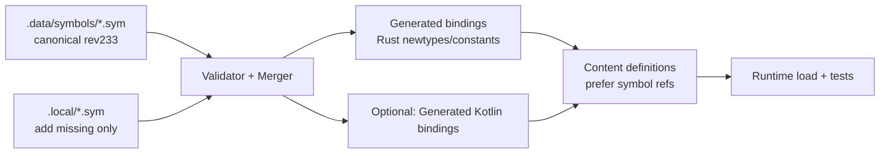
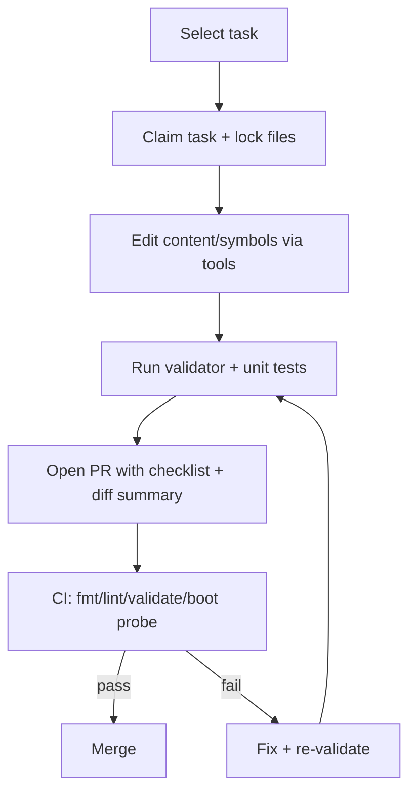

# Improving agent-driven contributions to rsmod for revision 233 content while preventing wrong IDs and symbols

## Executive summary

The `joshhmann/rsmod` repository is a fork of `rsmod/rsmod` and contains a multi-module layout (`api`, `content`, `engine`, `server`) plus a `.data` directory and several utility scripts whose names strongly suggest symbol-table maintenance (for example `distribute_syms.py`, `fix_syms.py`, and `map_obj_missing.py`). citeturn5view0 This is consistent with the workspace playbook you provided (OSRS-PS-DEV Rev 233), which treats `rsmod/.data/symbols/*.sym` as canonical “cache internal names” for OSRS revision 233 and explicitly warns that remapping an existing ID to a different name (especially via `.local/*.sym`) can cause collisions and hard-to-debug startup failures. fileciteturn2file0L129-L133

Preventing agents (human or LLM-driven) from introducing wrong IDs/symbols is best treated as a defense-in-depth problem. No single mechanism (type safety, runtime tests, or codegen) is sufficient by itself because ID mistakes are often “well-typed” (the value is a valid integer) but semantically wrong for the intended revision or domain. The most reliable approach is a layered pipeline: **(a) a revision-pinned source of truth**, **(b) compile-time friction against mixing domains and using raw integers**, **(c) runtime validation that checks content references against the canonical tables**, and **(d) workflow gates (pre-commit + CI + PR templates + bot checks) that make it difficult for agents to bypass validation**. fileciteturn2file0L23-L27

A practical “north star” architecture for rev 233 content work is:

- Treat `.data/symbols/*.sym` (and `.local/*.sym` overlays) as the canonical ID/name registry for rev 233 and keep it machine-validated. fileciteturn2file0L129-L133  
- Generate strongly typed ID bindings (Rust newtypes / typed IDs; optionally Kotlin bindings too) from the symbol tables in a reproducible build step (build script or a dedicated generator). citeturn19search2  
- Enforce “no raw ID literals in content-facing code” with lint rules (Clippy + deny/warn policies) and fail CI when violated. citeturn18search1turn18search8  
- Add validators and tests: uniqueness, referential integrity, and “rev 233 compatibility checks,” then run them as mandatory CI checks. fileciteturn2file0L103-L127  

Unspecified items that materially affect final design and sequencing: the exact scope of “rev 233 content” (which content types and how complete), team size / review bandwidth, and the CI environment’s ability to run heavyweight tasks (cache downloads, full boot probes). fileciteturn2file0L1-L6

## Repository and workspace findings relevant to IDs and symbols

From the repo’s top-level structure:

- The repo is explicitly shown as **forked from `rsmod/rsmod`**. citeturn5view0  
- It contains `.data` and `.github/workflows`, and separates code into `api`, `content`, `engine`, and `server` modules. citeturn5view0  
- It also includes scripts named `distribute_syms.py`, `fix_syms.py`, and `map_obj_missing.py`, which—taken together with the playbook—strongly indicates a workflow for generating/fixing/distributing symbol mappings and filling gaps. citeturn5view0  

From the Rev 233 playbook you provided (uploaded README):

- The workspace explicitly targets parity with OSRS **revision 233**. fileciteturn2file0L1-L4  
- It defines “Stability Gates (P0)” including `packCache`, a strict boot probe, and stable RSProx login flow before content work. fileciteturn2file0L23-L27  
- It establishes strict multi-agent workflow controls: claim tasks, check conflicts, lock files, validate, then complete tasks. fileciteturn2file0L38-L50  
- Most importantly for correctness: **Symbol Table Rules (Rev 233)** state that:
  - `rsmod/.data/symbols/*.sym` entries are canonical internal names for rev 233 and IDs must not be renamed.  
  - `.local/*.sym` is only for adding missing canonical names when they do not exist in the base `.sym`.  
  - Never map an existing ID to a different name in `.local/*.sym` because it can cause collisions and startup failures; instead update Kotlin code to use canonical names from base `.sym`. fileciteturn2file0L129-L133  

These are the strongest “local truths” to build on: **the canonical mapping exists, and incorrect remaps have already been identified as a high-impact failure mode**. fileciteturn2file0L129-L133

## Where agent edits drift and how wrong IDs/symbols are introduced

### Drift patterns that are specific to rev-pinned symbol tables

The playbook’s warnings imply at least three common drift patterns:

- Agents “fix” a name by **renaming an ID’s canonical symbol** (violating the rule that `.data/symbols/*.sym` entries are canonical and should not be renamed). fileciteturn2file0L129-L133  
- Agents “patch” missing names by putting changes in the wrong place or wrong direction: using `.local/*.sym` to **remap an existing ID** instead of *only* adding missing canonical names. fileciteturn2file0L129-L133  
- Agents introduce “locally consistent but globally conflicting” symbols: the local mapping works for a single feature branch but creates collisions (events, triggers, or references) that only reveal themselves at startup—matching the playbook’s statement about “event collisions and hard-to-debug startup failures.” fileciteturn2file0L129-L133  

### Drift patterns that are typical in agent-driven code contributions (LLM or otherwise)

Even with correct workflows, agent systems tend to drift in predictable ways:

- **Hallucinated identifiers**: the agent invents an ID or symbol name that “looks plausible,” especially when working from incomplete context. The ReAct paper explicitly frames external interaction as a way to reduce hallucination and error propagation in multi-step reasoning workflows. citeturn24view0  
- **Stale or mismatched sources**: agents may draw from wiki pages, other revisions, or older internal notes. Retrieval-Augmented Generation (RAG) is specifically proposed to integrate parametric generation with retrieval from an external corpus, improving factuality and traceability for knowledge-intensive tasks. citeturn24view1  
- **Patch-level success masking semantic failure**: code compiles and tests pass, but the game content is wrong (e.g., a spawn points to a valid NPC ID—just not the intended one). This is exactly the kind of failure that requires content-aware validation, not only type checking.  
- **Workflow noncompliance**: agents skip “boring” steps (locks, formatting, boot probes). Your playbook already anticipates this by making gates mandatory and requiring explicit validation steps before completion. fileciteturn2file0L103-L127  

If you treat this as a software engineering benchmark problem, SWE-bench is a concrete reminder: automated agents are evaluated on whether they produce patches that resolve real issues in real repositories, and the harness approach (reproducible evaluation, strong pass/fail signals) is the right mental model for “ID correctness harnesses” too. citeturn23search3

## Rust compile-time strategies to prevent wrong IDs/symbols

Even though `rsmod` is primarily a JVM/Gradle project (the repo README indicates Java 21 requirement). citeturn5view0  
…Rust can still play a powerful role as a **validator/code generator** that makes incorrect edits harder to express and easier to detect. The techniques below can be implemented in a Rust tool crate (e.g., `tools/rsmod-idgen` or `xtask`) and then called from Gradle/CI.

### Strong typing with the newtype idiom

Rust’s “newtype idiom” exists specifically to provide compile-time guarantees that the correct type of value is supplied—classic for preventing unit mix-ups (Years vs Days), and directly applicable to ID-domain mix-ups (NpcId vs ObjId). citeturn18search2

A canonical minimal pattern:

```rust
#[repr(transparent)]
#[derive(Debug, Clone, Copy, PartialEq, Eq, Hash, PartialOrd, Ord)]
pub struct NpcId(u32);

#[repr(transparent)]
#[derive(Debug, Clone, Copy, PartialEq, Eq, Hash, PartialOrd, Ord)]
pub struct ObjId(u32);

impl NpcId {
    pub const fn new(raw: u32) -> Self { Self(raw) }
    pub const fn raw(self) -> u32 { self.0 }
}

impl ObjId {
    pub const fn new(raw: u32) -> Self { Self(raw) }
    pub const fn raw(self) -> u32 { self.0 }
}

// Compile error: expected NpcId, found ObjId.
fn set_spawn_npc(_npc: NpcId) {}

fn example() {
    let sword = ObjId::new(1277);
    // set_spawn_npc(sword); // <- should not compile
}
```

Using `#[repr(transparent)]` is valuable when you need layout/ABI equivalence to the wrapped field; the Rust Reference defines constraints and guarantees for the `transparent` representation. citeturn20search0

### Domain-typed IDs with PhantomData for extensibility

If you have many ID domains (objs, npcs, locs, varps, enums, etc.), you can use a single generic ID type with phantom domain markers:

```rust
use core::marker::PhantomData;

pub trait Domain {
    const NAME: &'static str;
}

pub enum Npc {}
pub enum Obj {}

impl Domain for Npc { const NAME: &'static str = "npc"; }
impl Domain for Obj { const NAME: &'static str = "obj"; }

#[repr(transparent)]
#[derive(Debug, Clone, Copy, PartialEq, Eq, Hash)]
pub struct Id<D: Domain>(u32, PhantomData<D>);

impl<D: Domain> Id<D> {
    pub const fn new(raw: u32) -> Self { Self(raw, PhantomData) }
    pub const fn raw(self) -> u32 { self.0 }
}

pub type NpcId = Id<Npc>;
pub type ObjId = Id<Obj>;
```

This scales better than one type per domain if you want uniform APIs for parsing/validation/codegen.

### Const generics for “revision and bounds” encoding

Const generics can parameterize types over constant values. The Rust Reference documents syntax and constraints for const generic parameters. citeturn21view0

You can use this to encode revision pinning or upper bounds in types (with care—const generics can increase complexity quickly):

```rust
pub enum Npc {}
pub trait Domain { const NAME: &'static str; }
impl Domain for Npc { const NAME: &'static str = "npc"; }

#[repr(transparent)]
pub struct RevId<D: Domain, const REV: u32>(u32, core::marker::PhantomData<D>);

pub type NpcId233 = RevId<Npc, 233>;
```

This doesn’t validate “semantic correctness” (the NPC can still be wrong), but it:
- Stops accidental mixing between rev 233 and other revisions if you ever support multiple revisions concurrently.
- Forces APIs to be explicit about which revision they accept.

### Macros and code generation as “compile-time guardrails”

Type wrappers prevent mixing domains, but they do not prevent “wrong-but-valid ID within domain.” That’s where code generation becomes critical: if you generate *named* constants or enums from canonical symbol tables, agents stop typing raw numbers entirely.

At a high level:

- Parse `rsmod/.data/symbols/*.sym` and generate Rust code like:
  - `pub const NpcId::MAN: NpcId = NpcId::new(123);`
  - `pub fn npc_symbol(name: &str) -> Option<NpcId> { … }`
- Make all hand-written content code reference `NpcId::MAN` or `npc!("man")` rather than `123`.

This is best implemented via:
- A Rust generator binary (fast to run in CI, easy to diff output), or
- `build.rs` build scripts (automatic, but can complicate workspaces).

Cargo build scripts are explicitly designed to run during compilation and can be configured to rerun when inputs change using `cargo::rerun-if-changed`. citeturn19search2

### Lint policies that enforce “no raw IDs in content code”

Clippy and Rust lint attributes let you turn classes of issues into CI failures. Clippy docs describe using `allow/warn/deny` (and that `deny` causes errors and a non-zero exit code, which is CI-friendly). citeturn18search1 The Rust Reference also documents tool lint attributes (like `clippy::pedantic`) and how they behave. citeturn18search8

A practical policy approach for an ID-heavy content crate:

- Allow raw integers in low-level parsing modules only.
- Forbid raw integers in content definition modules by denying specific lint patterns and enforcing typed constructors/macros.

Example (crate root):

```rust
#![deny(warnings)]
#![deny(clippy::unwrap_used)]
#![deny(clippy::expect_used)]
// Consider enabling pedantic gradually; it can be noisy.
#![warn(clippy::pedantic)]
```

Then in modules that legitimately need raw parsing, explicitly scope exceptions:

```rust
#[allow(clippy::unwrap_used)]
fn parse_legacy_format(...) { ... }
```

## Runtime validation and CI gates for rev 233 correctness

### Validation is mandatory because “wrong ID” is usually still well-typed

The playbook’s warning about collisions and startup failures implies that **semantic integrity** (not just type correctness) must be continuously validated. fileciteturn2file0L129-L133

Recommended validation layers:

- **Symbol table integrity** (static):
  - No duplicate IDs within a domain file.
  - No duplicate names within a domain file.
  - `.local/*.sym` only introduces new mappings; never overrides base mappings (enforce mechanically). fileciteturn2file0L129-L133  

- **Content referential integrity** (static):
  - Every referenced symbol exists in canonical table.
  - Cross-domain references are consistent (spawn uses NPC ID, drops use obj ID, etc.).

- **Runtime smoke gates** (dynamic):
  - Pack/build step (e.g., `packCache`) before starting.
  - Boot probe with a deterministic success marker.
  - Optional “content scenario” probes (spawn one NPC, interact, etc.) depending on CI feasibility. fileciteturn2file0L23-L27  

### Sample Rust unit tests for symbol-table correctness

Assume `.sym` format is line-oriented (e.g., `id=name` or `name=id`). The specific parser will vary, but the test shape is stable.

```rust
use std::collections::{HashMap, HashSet};

#[test]
fn sym_table_has_unique_ids_and_names() {
    let content = include_str!("../../rsmod/.data/symbols/npc.sym");
    let mut ids = HashSet::new();
    let mut names = HashSet::new();

    for (lineno, line) in content.lines().enumerate() {
        let line = line.trim();
        if line.is_empty() || line.starts_with('#') { continue; }

        let (id_str, name) = line.split_once('=')
            .unwrap_or_else(|| panic!("Invalid format at line {}", lineno + 1));

        let id: u32 = id_str.parse()
            .unwrap_or_else(|_| panic!("Bad id at line {}", lineno + 1));

        assert!(ids.insert(id), "Duplicate id {} at line {}", id, lineno + 1);
        assert!(names.insert(name.to_string()), "Duplicate name '{}' at line {}", name, lineno + 1);
    }
}
```

### Property-based tests for parsers and “no silent corruption”

Property-based testing helps ensure your parser/formatter isn’t lossy and doesn’t mis-handle corner cases. Proptest is a widely used Rust property-testing framework, explicitly designed to shrink failing cases to minimal repro inputs. citeturn19search4

Example: “render(parse(line)) roundtrips for valid entries”:

```rust
use proptest::prelude::*;

fn parse_entry(s: &str) -> Option<(u32, String)> {
    let (id, name) = s.split_once('=')?;
    Some((id.parse().ok()?, name.to_string()))
}

fn render_entry(id: u32, name: &str) -> String {
    format!("{}={}", id, name)
}

proptest! {
    #[test]
    fn sym_entry_roundtrips(id in 0u32..200_000u32, name in "[a-z][a-z0-9_]{0,40}") {
        let line = render_entry(id, &name);
        let (id2, name2) = parse_entry(&line).expect("must parse rendered entry");
        prop_assert_eq!(id2, id);
        prop_assert_eq!(name2, name);
    }
}
```

### Serde-based runtime validation for content files

If your content is represented in JSON/YAML/TOML, Serde is the de-facto ecosystem tool. Serde supports custom serialization and deserialization via implementing `Serialize` / `Deserialize` when derive defaults aren’t enough. citeturn18search0

Two pragmatic patterns:

- **Deserialize as symbol string, not numeric**: force all content to use canonical names (`"man"`) and only allow numbers in a special “escape hatch” format that fails CI unless explicitly allowed.
- **Deserialize then validate**: parse into a struct and then validate against loaded symbol tables (best for rich checks like “this object exists and is interactable”).

### CI configuration recommendations

Your repo already contains `.github/workflows`, so GitHub Actions is a natural place to enforce correctness gates. citeturn5view0 GitHub’s workflow syntax docs describe workflows as YAML-defined automated processes with jobs/steps. citeturn27search0

A sample **CI workflow** that adds Rust-based validation while being compatible with a JVM project:

```yaml
name: ci

on:
  pull_request:
  push:
    branches: [ main ]

jobs:
  validate-symbols-and-content:
    runs-on: ubuntu-latest
    steps:
      - uses: actions/checkout@v4

      # If CI needs the JVM build too (rsmod requires Java 21 per repo README)
      - name: Set up Java
        uses: actions/setup-java@v4
        with:
          distribution: temurin
          java-version: "21"

      - name: Set up Rust
        uses: dtolnay/rust-toolchain@stable
        with:
          components: rustfmt, clippy

      - name: Rust format
        run: cargo fmt --all -- --check

      - name: Rust lint
        run: cargo clippy --all-targets --all-features -- -D warnings

      - name: Validate symbols and content (rev 233)
        run: cargo run -p rsmod_validator -- validate --rev 233

      - name: Rust tests
        run: cargo test --all --all-features
```

Notes:
- `cargo fmt` usage is standard once rustfmt is installed (e.g., via `rustup component add rustfmt`); rustfmt’s repo documents both rustup installation and `cargo fmt` usage. citeturn20search2  
- For faster, more stable CI test execution, consider `cargo-nextest` (not required, but useful as test suites grow). citeturn25search3turn25search0  

### Pre-commit hooks to prevent “bad diffs” from ever reaching CI

The playbook already treats workflow compliance as mandatory (claim/lock/validate). fileciteturn2file0L38-L50 A complementary approach is to enforce local hooks.

The `pre-commit` framework provides a standardized way to run checks on staged files before commits; its docs center around discovering/defining hooks in `.pre-commit-config.yaml`. citeturn25search5

A simple `.pre-commit-config.yaml` conceptually:

```yaml
repos:
  - repo: local
    hooks:
      - id: rustfmt
        name: cargo fmt
        entry: cargo fmt --all
        language: system
        pass_filenames: false

      - id: clippy
        name: cargo clippy
        entry: cargo clippy --all-targets --all-features -- -D warnings
        language: system
        pass_filenames: false

      - id: validate-symbols
        name: validate symbols/content
        entry: cargo run -p rsmod_validator -- validate --rev 233
        language: system
        pass_filenames: false
```

(If you want to follow pre-commit’s preference for managed-language hooks, you can wrap these in a small Rust or Python hook repo, but the core idea stands.) citeturn25search5

### Tooling ergonomics to keep agents “on the rails”

Agents often mis-edit because they can’t quickly find correct definitions. In Rust ecosystems:

- rust-analyzer configuration provides diagnostics on save using a configurable check command; its docs enumerate `rust-analyzer.check.command` and related settings. citeturn25search2  
- Do **not** default rust-analyzer to running clippy on every save in large workspaces unless performance is acceptable; keep `cargo check` on save and run clippy in CI/pre-commit. (This is an ergonomics point; the configuration knobs exist either way.) citeturn25search2

## Code generation, schema/versioning for rev 233, and migration strategies

### A recommended “source of truth” stack for rev 233

Your playbook already defines a strong rule: `.data/symbols/*.sym` are canonical for rev 233. fileciteturn2file0L129-L133 The missing piece is to make that rule *mechanically enforced* and *consumable by tooling*.

A robust stack looks like:

- **Canonical layer**: `rsmod/.data/symbols/*.sym` (rev 233 canonical names and IDs). fileciteturn2file0L129-L133  
- **Overlay layer**: `.local/*.sym` only for “missing canonical names,” never for remaps. Enforce with a validator. fileciteturn2file0L129-L133  
- **Generated layer**: code bindings generated from canonical+overlay (Rust + optionally Kotlin), checked into the repo or generated in build (choose one policy and enforce it).
- **Content schema**: structured content files (or code-based definitions) that reference **symbols** (names) rather than **raw numeric IDs**.

### Comparing approaches: types vs runtime checks vs codegen

| Approach | What it prevents best | What it cannot prevent | Cost profile | Fit for “agent introduces wrong IDs” |
|---|---|---|---|---|
| Strong typing (newtypes, typed domains) | Mixing domains (`ObjId` used as `NpcId`); passing unvalidated raw values into the wrong APIs citeturn18search2turn20search0 | Wrong-but-valid domain IDs; outdated revision mismatches | Low–Medium (incremental refactors) | Necessary but not sufficient |
| Runtime validation (tests, validators, boot probes) | Semantic mismatches; collisions; missing symbols; wrong overlays; “works on my machine” errors fileciteturn2file0L23-L27 | Preventing creation of the bad diff itself; requires running gates | Medium (design + CI time) | High value; catches the “real” failures |
| Code generation from canonical tables | Eliminates manual numeric entry; makes “invented symbol” fail early; creates autocompletion/IDE support citeturn19search2 | Generator bugs; large generated diffs; needs governance to avoid hand-editing generated outputs | Medium–High upfront; low ongoing | Best “agent-proofing” leverage when combined with validators |

**Recommended choice:** prioritize **code generation + runtime validation**, then enforce **strong typing** in the generated/public APIs. This combination makes it hard for agents to invent IDs *and* ensures correctness is verified against rev 233 rules.

### Mermaid diagrams for workflow and relationships

Entity relationship overview (symbols → generated bindings → content):



Agent contribution workflow with gates:



This aligns with your existing “claim + lock + validate + complete” operational contract. fileciteturn2file0L38-L50

### Migration strategy to reach “content up to rev 233” safely

Because the exact scope of rev 233 content is unspecified, the safest migration strategy is incremental and validator-driven:

- **Phase one: lock down the mapping rules**  
  Implement a validator that enforces the playbook’s symbol-table invariants (canonical base, overlay add-only, no remaps). fileciteturn2file0L129-L133  

- **Phase two: migrate content references to symbol-first**  
  Where content currently uses numeric IDs or non-canonical names, migrate to canonical symbols from base `.sym` (the playbook explicitly prefers updating code rather than remapping IDs). fileciteturn2file0L129-L133  

- **Phase three: systematically fill missing rev 233 pieces**  
  Add missing entries by:
  1) sourcing canonical internal names from the rev 233 cache processes you already reference (`osrs-cache` is named as the primary lookup mechanism), fileciteturn2file0L19-L21  
  2) adding only missing canonical names to `.local/*.sym`, and  
  3) regenerating bindings + running gates.

- **Phase four: reduce drift surface area**  
  Gradually forbid direct edits to generated bindings (CI check: “generated files are up-to-date and unmodified”), and route all symbol updates through a single tool path.

## Prioritized implementation plan toward rev 233 with effort and risk mitigations

The plan below is designed to reach rev 233 content goals while minimizing “wrong ID/symbol” regressions. Effort is relative (Low/Med/High) and depends on team size (unspecified) and CI capacity (unspecified). fileciteturn2file0L1-L6

| Milestone | Deliverable | Effort | Key risks | Mitigations |
|---|---|---:|---|---|
| Validator foundation | Rust (or Python) validator that enforces: unique IDs/names, `.local` add-only, no remaps; emits actionable diffs | Medium | Validator mismatches actual `.sym` semantics; false positives slow work | Start by mirroring playbook rules exactly; add “explain mode” output; allow temporary suppressions with explicit justification |
| CI enforcement | GitHub Actions job(s) that run: formatter(s), validator, unit tests; blocks merge on failure citeturn27search0turn25search6 | Medium | CI runtime too large (cache downloads); flakes | Split “fast checks” vs “heavy gates”; add caching; run heavy boot probes only on PR labels or nightly |
| Codegen bindings | Generator parses merged symbol tables and outputs typed Rust IDs (newtype/domain IDs) + symbol lookup functions; wired via build script or dedicated tool citeturn19search2turn18search2 | High | Large diffs; merge conflicts; generator bugs | Check in generated code with deterministic formatting; CI verifies generator output matches committed code; keep output stable |
| Typed ID adoption | Refactor validator/content tooling to use typed IDs exclusively (no raw integers in content-facing APIs) citeturn18search2turn20search0 | Medium | Refactor churn, agent confusion | Provide migration helpers (`From<u32>` only in internal modules); clippy denies in content modules; good docs/snippets |
| Test harness expansion | Add property-based tests for parsers + integration tests that load representative content sets citeturn19search4 | Medium | Test design complexity; flakiness | Keep property tests small; cap cases/time; run heavier tests in nightly CI |
| Rev 233 content ramp | Structured backlog (by domain: objs/npcs/locs/varps/etc.) and a repeatable “add content” workflow that always goes through validator + codegen | High | Scope unclear; partial progress hard to measure | Introduce a rev 233 “coverage dashboard” (counts of mapped IDs, missing entries, failing references); define DoD per content category |
| Agent workflow hardening | PR template + bot validations that require: claim/lock evidence, commands run, validator output, and forbid direct `.local` remaps | Low–Medium | Process overhead; resistance | Keep templates short; auto-fill via scripts; allow “manual override” label with reviewer approval |

### Concrete PR template and bot checks

Your playbook already requires a completion report listing claimed task, locked files, commands run, results, and cleanup steps. fileciteturn2file0L188-L196 Move this from “best practice” into GitHub PR structure:

- PR template checklist mirrors the playbook.
- CI bot comment posts validator results and highlights:
  - Any edits to `.data/symbols/*.sym`
  - Any edits to `.local/*.sym` that look like an override (same ID exists in base)
  - Any numeric literal additions in targeted directories (Rust: via grep + clippy; Kotlin: via custom scripts)

### Why these milestones work for agent-driven work

They operationalize academic/industry lessons about agent alignment:

- ReAct emphasizes interleaving reasoning with external actions to reduce hallucination and error propagation; in your context, “actions” are running validators, boot probes, and performing cache lookups rather than inventing IDs. citeturn24view0  
- RAG explicitly motivates retrieving from an external, authoritative store to improve factuality and provenance—directly analogous to enforcing `osrs-cache` lookups for ID/name truth. citeturn24view1turn2file0L19-L21  
- Reflexion shows that incorporating feedback loops improves agent performance over time; CI/validator failures and structured PR feedback serve as that feedback loop for your agents. citeturn29view0  
- SWE-bench demonstrates the value of harness-based evaluation with reproducible runs and hard pass/fail criteria; that’s exactly how to treat “content correctness” gates. citeturn23search3
